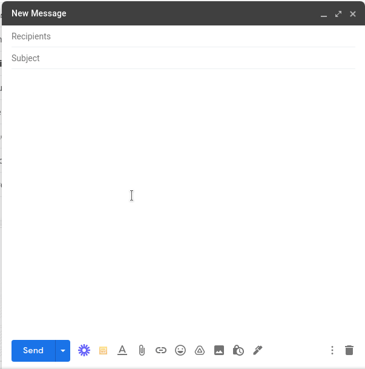

# Gmail Templates

## Instructions to build the application

1. Run `cd app` to navigate to the app folder.
2. Run `npm install` to install dependencies.
3. Run `npm start` to start the development server.

## Instructions to build the extension

1. From the root of the project.
2. Run `npm install` to install dependencies.
3. Run `npm run build` to build the extension and watch for changes.
4. In Chrome, go to chrome://extensions, turn on Developer mode, click "Load unpacked", and pick the "dist" directory within this project.
5. Open https://mail.google.com/ and click "Compose an email" at the top left.
6. There's a button added to the Compose view!
